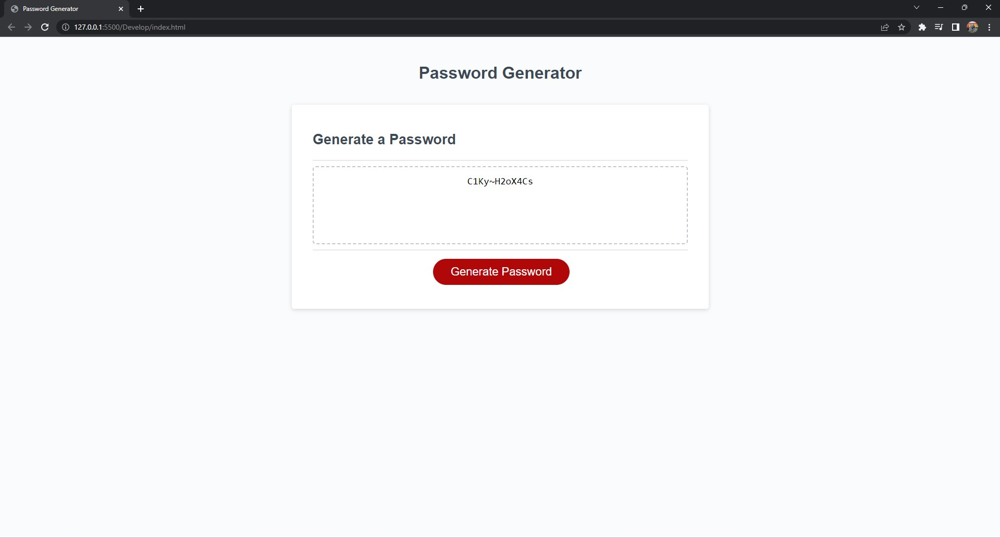

# Random Password Generator

## Description

This project is a random password generator that includes different criteria to generate a password. The criteria included are:

- A minimum character length of 8
- A maximum character length of 128
- At least one:
    - Uppercase letter
    - Lowercase letter
    - Number
    - Symbol

If each criteria is met, a random password will be generated with the user's specified character length. If each criteria is not met, a password will not be generated and the text box will be empty.

* When the user clicks "Generate Password", a prompt will ask how many characters they would like in their password.

* If the user does not enter a value, a prompt will ask them to enter a value.

* If the user enters a numeric value between 8 and 128, then they will be prompted to click OK to include: 

### Uppercase Letters

### Lowercase Letters

### Numbers

### Symbols

* Then, a random password will be generated.

## Technologies 

Built with:
* Javascript 
* HTML
* CSS

## Link

This is a linked to the deployed page to generate a random password:

* https://psong1.github.io/random-password-generator/